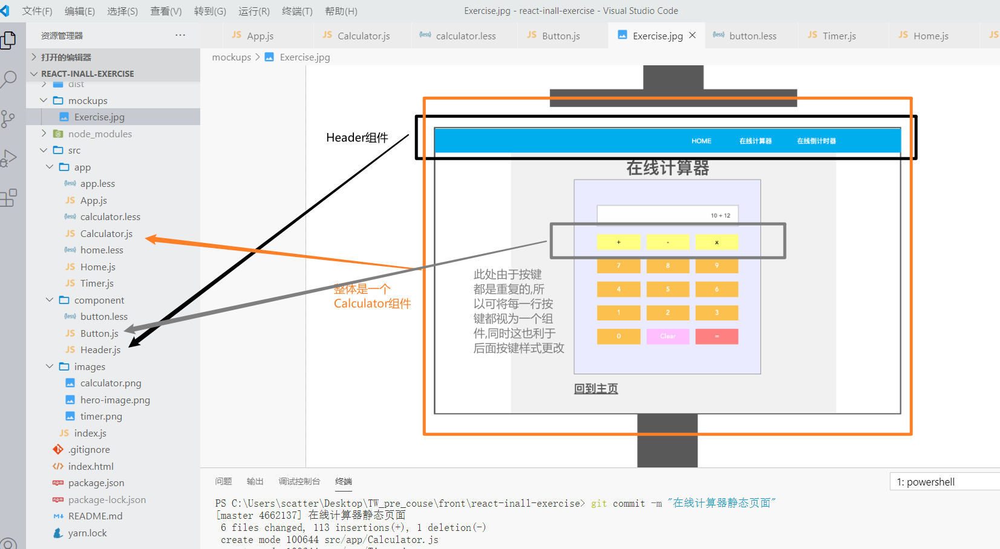

### 1.总体Tasking

> 3和2差不多,于是没有写完

1. 编辑Home页面
   1. 实现基本的样式
   2. 实现链接的跳转
2. 编辑计算器页面
   1. 完成静态页面
      1. 划分基础组件
      2. 实现页面元素的齐全
      3. 根据css样式进行进一步细分组件参数
      4. 实现css样式
   2. 实现计算器功能
      1. 编写script
      2. 使用事件绑定按键
      3. 根据事件绑定将对应数字使用innerHtml注入显示框
      4. 逻辑实现,根据要求AC完成计算器功能
3. 编辑倒计时页面
   1. 完成静态页面
      1. 划分组件
      2. 实现页面元素的齐全
      3. 根据css样式进行进一步细分组件参数
      4. 实现css样式
   2. 实现倒计时功能
      1. 使用组件获取输入时间并传递
      2. ...

### 2.计算器页面组件

**REACT组件的层级为**

- Calculator
  - Header
  - Button

> html的结构层级就是Calculator - ->  Header  -->  Button

